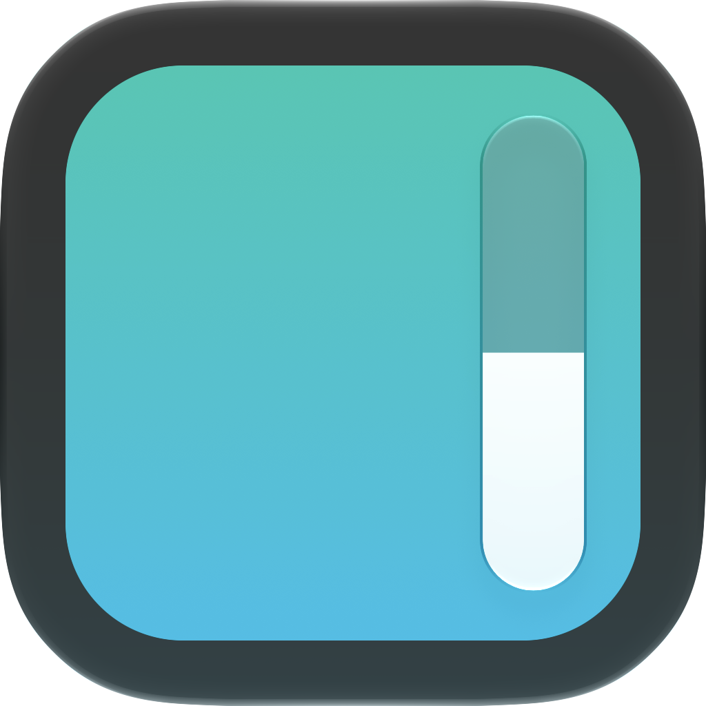
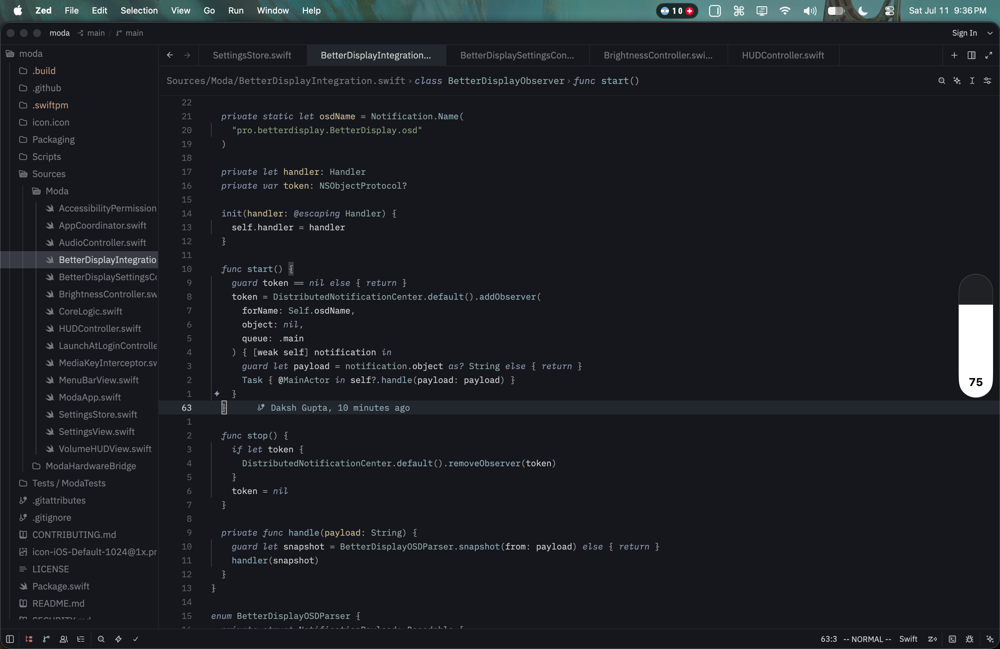

<p align="center">
  
</p>

<h1 align="center">Moda</h1>

<p align="center">
  A focused, liquid-glass volume and brightness HUD for macOS.
</p>

<p align="center">
  
  
  <a href="LICENSE"></a>
</p>

Moda is a lightweight macOS app that overhauls the built-in volume and brightness dialogs. I always wanted a dialog with precise control that stays out of the way, so I created Moda. It's essentially feature-complete, and I don't plan on adding anything beyond what is already included.

**Tip: Use Command+Brightness keys to adjust keyboard brightness as well.**

**⚠️ BetterDisplay is needed for the brightness control (too lazy to implement it myself).**

<p align="center">
  
</p>

## Download

Download [Moda v1.0](https://github.com/DakshG07/moda/releases/latest/download/Moda-v1.0.dmg), open the DMG, and drag Moda into Applications.

Moda uses a local development signature rather than Apple notarization. On first launch, right-click Moda in Applications, choose **Open**, and confirm the macOS prompt. Then grant Accessibility access when requested.

## Features

- Replaces the native volume HUD and controls output volume through Core Audio.
- Reflects display brightness changes reported by BetterDisplay.
- Controls keyboard backlight brightness with Command-Brightness keys.
- Supports click-and-drag and two-finger scrolling directly on the HUD.

## Requirements

- macOS 26 or newer.
- Accessibility permission, used to intercept media keys and suppress the native volume HUD.
- [BetterDisplay](https://github.com/waydabber/BetterDisplay) for display-brightness reflection.
- Xcode 26+ with a Swift 6.2-compatible toolchain to build from source.

Keyboard brightness uses a system-private framework and is hardware-dependent. Moda is therefore intended as a personal/local macOS build rather than a Mac App Store app.

## Install from source

```sh
git clone https://github.com/DakshG07/moda.git
cd moda
./Scripts/build-app.sh
ditto .build/Moda.app /Applications/Moda.app
open /Applications/Moda.app
```

The first time Moda launches, grant it access in **System Settings → Privacy & Security → Accessibility**.

### BetterDisplay setup

In Moda's settings, use the BetterDisplay integration button, or enable BetterDisplay's application/OSD integration and disable BetterDisplay's own OSD. BetterDisplay remains responsible for changing display brightness; Moda only reflects the resulting value.

## Development

Run the test suite:

```sh
swift test --disable-sandbox
```

Build and package the app:

```sh
./Scripts/build-app.sh
```

The finished bundle is written to `.build/Moda.app`.

### Code signing

The packaging script selects signing in this order:

1. The identity supplied through `MODA_CODE_SIGN_IDENTITY`.
2. A local identity named `Moda Local Development`, when installed.
3. An ad-hoc signature for contributors without a certificate.

To choose an identity explicitly:

```sh
MODA_CODE_SIGN_IDENTITY="Apple Development: Your Name" ./Scripts/build-app.sh
```

Ad-hoc builds work locally but macOS may treat each rebuild as a new app for Accessibility permission. A consistent development or local self-signed identity avoids that.

## Architecture

| Component | Responsibility |
| --- | --- |
| `MediaKeyInterceptor` | Decodes and conditionally consumes media-key events. |
| `AudioController` | Tracks the default output device and applies volume/mute changes. |
| `BetterDisplayBrightnessController` | Observes BetterDisplay brightness notifications. |
| `KeyboardBrightnessController` | Controls supported built-in keyboard backlights. |
| `HUDController` | Owns the nonactivating panel, display placement, and lifecycle. |
| `VolumeHUDView` | Renders the liquid-glass slider and numeric transitions. |
| `SettingsStore` | Persists user preferences. |

## Privacy

Moda has no analytics, account system, or network service. It listens for media keys, reads local audio/display state, and stores preferences in `UserDefaults`.

## Contributing

Bug reports and focused pull requests are welcome. See [CONTRIBUTING.md](CONTRIBUTING.md) before making a change.

## License

Moda is available under the [MIT License](LICENSE).
